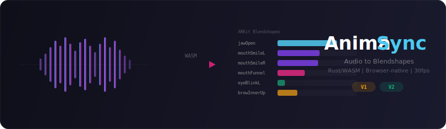

<div align="center">



<br><br>

**Voice-driven 3D avatar animation engine for the browser.**

Extracts emotion from speech and generates lip sync, facial expressions, and body motion in real time — entirely client-side via Rust/WASM.

<br>

[](https://www.npmjs.com/package/@goodganglabs/lipsync-wasm-v1)
&nbsp;
[](https://www.npmjs.com/package/@goodganglabs/lipsync-wasm-v2)

[Live Demo (V1)](https://lipsync-wasm.quasar.ggls.dev/v1/demo/)
&ensp;·&ensp;
[Live Demo (V2)](https://lipsync-wasm.quasar.ggls.dev/v2/demo/)
&ensp;·&ensp;
[Side-by-side](https://lipsync-wasm.quasar.ggls.dev/demo/)
&ensp;·&ensp;
[npm V1](https://www.npmjs.com/package/@goodganglabs/lipsync-wasm-v1)
&ensp;·&ensp;
[npm V2](https://www.npmjs.com/package/@goodganglabs/lipsync-wasm-v2)

</div>

<br>

---

## Features

<table>
<tr>
<td width="50%">

**Voice → Full-body Animation**<br>
<sub>Not just lip sync. Analyzes speech to generate lip movements, emotional facial expressions, eye blinks, and body poses — all from a single audio stream.</sub>

**Emotion-aware Expressions**<br>
<sub>Automatically maps vocal characteristics to facial expressions. Eyebrow raises, smile intensity, jaw dynamics, and blink patterns respond to how things are said, not just what is said.</sub>

**Built-in Body Motion**<br>
<sub>Embedded VRMA bone animation clips (idle / speaking poses) with automatic crossfade. Your avatar breathes, shifts weight, and moves naturally — out of the box.</sub>

</td>
<td width="50%">

**Browser-native WASM**<br>
<sub>No server needed. Entire pipeline runs in the browser at 30fps with near-native performance via Rust → WebAssembly. ARKit-compatible 52 or 111-dim output.</sub>

**Real-time Streaming**<br>
<sub>AudioWorklet-based microphone capture with ~300ms latency. Feed live mic, TTS, or recorded audio — get animated avatar frames back instantly.</sub>

**Plug & Play**<br>
<sub>3 lines of code to go from audio to animated avatar. 30-day free trial, no signup. First-class Three.js + VRM integration.</sub>

</td>
</tr>
</table>

---

## What AnimaSync Does

Most lip sync engines stop at mouth shapes. AnimaSync goes further — it treats voice as the **complete animation source**:

| Layer | What it generates | How |
|-------|-------------------|-----|
| **Lip Sync** | Mouth shapes matching phonemes | ONNX inference → ARKit blendshapes (jaw, mouth, tongue) |
| **Facial Expression** | Emotion-driven brows, cheeks, eyes | Voice energy & pitch → expression mapping + anatomical constraints |
| **Eye Animation** | Natural blinks, micro-movements | Stochastic blink injection (2.5–4.5s intervals, 15% double-blink) |
| **Body Motion** | Idle breathing, speaking gestures | Embedded VRMA bone clips with automatic idle ↔ speaking crossfade |

One audio stream in → a fully animated 3D avatar out.

---

## Quick Start

### Install

```bash
# V2 recommended for most use cases
npm install @goodganglabs/lipsync-wasm-v2

# V1 for full 111-dim expression control
npm install @goodganglabs/lipsync-wasm-v1
```

> Peer dependency: [`onnxruntime-web`](https://www.npmjs.com/package/onnxruntime-web) >= 1.17.0

### Minimal Example

```javascript
import { LipSyncWasmWrapper } from '@goodganglabs/lipsync-wasm-v2';

const lipsync = new LipSyncWasmWrapper();
await lipsync.init(); // 30-day free trial — no key needed

// One call — get lip sync + expressions + blinks, all at once
const result = await lipsync.processFile(audioFile);
for (let i = 0; i < result.frame_count; i++) {
  const frame = lipsync.getFrame(result, i); // number[52] — full face animation
  applyToYourAvatar(frame);
}
```

### CDN (No Bundler)

```html
<script src="https://cdn.jsdelivr.net/npm/onnxruntime-web@1.17.0/dist/ort.min.js"></script>
<script type="module">
  const CDN = 'https://cdn.jsdelivr.net/npm/@goodganglabs/lipsync-wasm-v2@latest';
  const { LipSyncWasmWrapper } = await import(`${CDN}/lipsync-wasm-wrapper.js`);

  const lipsync = new LipSyncWasmWrapper({ wasmPath: `${CDN}/lipsync_wasm_v2.js` });
  await lipsync.init();
  // Ready to process audio
</script>
```

---

## Examples

Working examples you can run locally — zero npm install, all loaded from CDN.

| Example | Description | Source |
|---------|-------------|--------|
| **[Basic](examples/vanilla-basic/)** | Audio → animated blendshape visualization. No 3D, pure API demo. | [index.html](examples/vanilla-basic/index.html) |
| **[VRM Avatar](examples/vanilla-avatar/)** | Full 3D avatar — lip sync, expressions, body motion, mic streaming. | [index.html](examples/vanilla-avatar/index.html) |
| **[V1 vs V2](examples/vanilla-comparison/)** | Side-by-side dual avatar comparison. Same voice, two animation engines. | [index.html](examples/vanilla-comparison/index.html) |

**Run any example:**

```bash
cd examples/vanilla-basic   # or vanilla-avatar, vanilla-comparison
npx serve .                  # or: python3 -m http.server 8080
```

---

## V1 vs V2

| | V2 (Recommended) | V1 (Full Control) |
|---|---|---|
| **npm** | `@goodganglabs/lipsync-wasm-v2` | `@goodganglabs/lipsync-wasm-v1` |
| **Output** | 52-dim ARKit blendshapes | 111-dim ARKit blendshapes |
| **Model** | Student distillation (direct prediction) | Phoneme classification → viseme mapping |
| **Post-processing** | crisp_mouth + fade + auto-blink | OneEuroFilter + anatomical constraints |
| **Expression generation** | Blink injection in post-process | Built-in `IdleExpressionGenerator` (blinks + micro-expressions) |
| **Voice activity** | Not included | Built-in `VoiceActivityDetector` (body pose switching) |
| **ONNX fallback** | None (ONNX required) | Heuristic mode (energy-based) |
| **Body motion** | VRMA idle/speaking (both versions) | VRMA idle/speaking + VAD auto-switch |
| **Best for** | Most projects, quick integration | Full expression control, custom avatars |

---

## Architecture

```
┌─────────────────────────────────────────────────────────────────────┐
│  Browser                                                             │
│                                                                      │
│  Audio Source (File / Mic / TTS)                                     │
│       │                                                              │
│       ▼                                                              │
│  ┌──────────┐    ┌────────────┐    ┌──────────────────────────────┐ │
│  │   WASM   │    │    ONNX    │    │           WASM               │ │
│  │ Feature  │───▶│ Inference  │───▶│  Post-processing             │ │
│  │ Extract  │    │   (JS)     │    │  + Expression mapping        │ │
│  └──────────┘    └────────────┘    └────────────┬─────────────────┘ │
│                                                  │                   │
│                        ┌─────────────────────────┼────────────┐     │
│                        │                         │            │     │
│                        ▼                         ▼            ▼     │
│                   Lip Sync              Facial Expression   Blinks  │
│                 (jaw, mouth,          (brows, cheeks,     (natural  │
│                  tongue)               smile, frown)     stochastic)│
│                        │                         │            │     │
│                        └─────────────┬───────────┘            │     │
│                                      ▼                        │     │
│                           52/111-dim ARKit Blendshapes @30fps │     │
│                                      │  ◄─────────────────────┘     │
│                                      ▼                              │
│                        ┌──────────────────────────┐                 │
│                        │  VRMA Bone Animation      │                │
│                        │  idle ↔ speaking crossfade │                │
│                        │  (body pose + gestures)   │                │
│                        └────────────┬─────────────┘                 │
│                                     ▼                               │
│                           3D Avatar (Three.js / Babylon / Unity)    │
└─────────────────────────────────────────────────────────────────────┘
```

### V2 Pipeline

```
Audio 16kHz PCM
  → [WASM] librosa-compatible features: 141-dim @30fps
  → [JS]   ONNX student model → 52-dim (lip sync + expressions)
  → [WASM] crisp_mouth (mouth sharpening) → fade_in_out (natural onset/offset)
  → [WASM] add_blinks (stochastic eye animation)
  → [WASM] Preset blending: expression channels (brows, eyes) blended with lip sync
  → [VRMA] Bone animation: idle ↔ speaking pose auto-crossfade
```

### V1 Pipeline

```
Audio 16kHz PCM
  → [WASM] MFCC extraction: 13-dim @100fps
  → [JS]   ONNX inference: 61 phoneme → 22 visemes
  → [WASM] Viseme → 111-dim ARKit blendshapes (lip + expression + extras)
  → [WASM] FPS conversion: 100fps → 30fps
  → [WASM] Anatomical constraints (bilateral symmetry + jaw correction)
  → [WASM] OneEuroFilter (temporal smoothing for natural motion)
  → [WASM] Preset blending: face 40% (expression) + mouth 60% (lip sync)
  → [WASM] IdleExpressionGenerator: blinks (2.5–4.5s, 15% double) + micro-expressions
  → [VRMA] Bone animation: idle ↔ speaking pose crossfade (VAD-triggered)
```

---

## API Reference

Both V1 and V2 expose the same `LipSyncWasmWrapper` class:

```typescript
class LipSyncWasmWrapper {
  constructor(options?: { wasmPath?: string });

  readonly ready: boolean;
  readonly modelVersion: 'v1' | 'v2';
  readonly blendshapeDim: 111 | 52;

  // Initialize — validates license + loads ONNX model
  init(options?: {
    licenseKey?: string;
    onProgress?: (stage: string, percent: number) => void;
    preset?: boolean | string;
  }): Promise<{ mode: string }>;

  // Batch processing
  processFile(file: File): Promise<ProcessResult>;
  processAudio(pcm16k: Float32Array): Promise<ProcessResult>;
  processAudioBuffer(buf: AudioBuffer): Promise<ProcessResult>;

  // Real-time streaming
  processAudioChunk(chunk: Float32Array, isLast?: boolean): Promise<ProcessResult | null>;

  // Extract single frame
  getFrame(result: ProcessResult, index: number): number[];

  // Bone animations
  getVrmaBytes(): { idle: Uint8Array; speaking: Uint8Array };

  // Cleanup
  reset(): void;
  dispose(): void;
}

interface ProcessResult {
  blendshapes: number[];  // flat array: frame_count × dim
  frame_count: number;
  fps: number;            // always 30
  mode: string;
}
```

### Method Quick Reference

| Method | Use Case |
|--------|----------|
| `processFile(file)` | File upload → returns lip sync + expression + blink frames |
| `processAudio(float32)` | Pre-loaded audio (e.g., fetched from TTS API) |
| `processAudioChunk(chunk)` | Real-time mic / TTS streaming |
| `getVrmaBytes()` | Bone animation clips for idle breathing & speaking gestures |
| `reset()` | Clear streaming state between utterances |

### Loading Progress Stages

```javascript
await lipsync.init({
  onProgress: (stage, percent) => {
    // stage: 'wasm' → 'license' → 'decrypt' → 'onnx'
    updateProgressBar(stage, percent);
  }
});
```

### Real-time Streaming Pattern

```javascript
// 1. Capture mic audio at 16kHz via AudioWorklet
const ctx = new AudioContext({ sampleRate: 16000 });
// ... setup AudioWorklet (see examples/vanilla-avatar)

// 2. Feed chunks → get blendshape frames back
worklet.port.onmessage = async (e) => {
  const result = await lipsync.processAudioChunk(e.data);
  if (result) {
    for (let i = 0; i < result.frame_count; i++) {
      frameQueue.push(lipsync.getFrame(result, i));
    }
  }
};

// 3. Consume at 30fps in render loop
function render() {
  requestAnimationFrame(render);
  if (frameQueue.length > 0) {
    applyToAvatar(frameQueue.shift());
  }
}
```

---

## Licensing

### 30-Day Free Trial

Call `init()` without a license key. All features available, no signup needed.

```javascript
await lipsync.init();                                    // free trial
await lipsync.init({ licenseKey: 'ggl_your_key' });     // paid license
```

| | Free Trial | Paid License |
|---|---|---|
| **Duration** | 30 days from first use | Unlimited |
| **Setup** | None (automatic) | Pass `licenseKey` to `init()` |
| **Domain** | Any | Configurable per key |
| **Features** | Full access | Full access |

Contact [GoodGang Labs](https://goodganglabs.com) for license inquiries.

---

## Security

- ONNX models are **AES-256-GCM encrypted** and embedded into the WASM binary
- No separate model files are served — decryption happens at runtime
- License tokens are **Ed25519 signed** with 24-hour TTL
- Tokens cached in `sessionStorage` to minimize server requests

---

<div align="center">

Built by [GoodGang Labs](https://goodganglabs.com)

</div>
